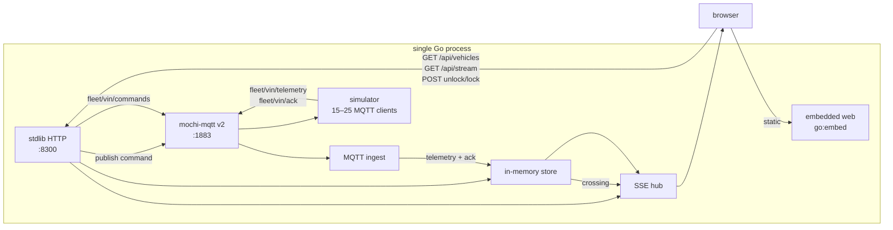

# Fleet Pulse

A single-process fleet simulator. One Go binary hosts an embedded MQTT broker,
in-memory store, HTTP API, and the production UI. Simulated vehicles connect as
real MQTT clients. There is no database and no authentication.

```text
go run ./cmd/server
```

Then open `http://127.0.0.1:8300`. Vite on `:3300` is only a development convenience.

| Surface | Port | Bind |
|---|---:|---|
| HTTP API + embedded UI | 8300 | `0.0.0.0` |
| Vite (optional) | 3300 | `0.0.0.0` |
| MQTT broker | 1883 | `0.0.0.0` |

## Architecture



The HTTP contract is in [`openapi.yaml`](openapi.yaml): snapshot, SSE stream,
unlock, lock, command lookup, and `healthz`.

## Trade-offs

The fleet and command machines live in an **in-memory store**. That keeps the
MVP to one process with no Compose or database, and it makes the demo start in
seconds. The cost is total: a restart wipes last-known positions, command
history, and the event feed. Persistence, replicas, and auth are out of scope.

Shutdown drains SSE clients first, then stops the simulator, then closes the
broker.

## Develop

```text
pnpm --dir web install --frozen-lockfile
pnpm --dir web test
pnpm --dir web build
cp -r web/dist/. internal/webui/dist/
GOTMPDIR="$PWD/.gotmp" go test ./...
GOTMPDIR="$PWD/.gotmp" go test -race ./...
```

`go:embed` reads `internal/webui/dist`. Rebuild the UI and copy it there before
shipping a binary that serves a new frontend.
