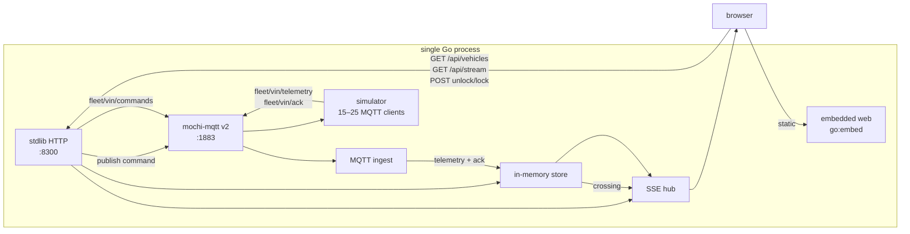
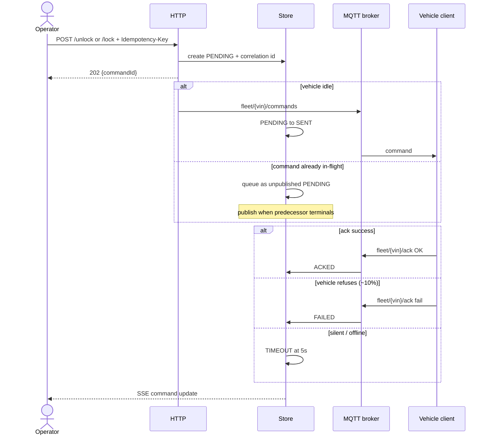

# Architecture diagrams

## Runtime

```mermaid
flowchart LR
  subgraph process["single Go process"]
    HTTP["stdlib HTTP\n:8300"]
    SSE["SSE hub"]
    Store["in-memory store"]
    Ingest["MQTT ingest"]
    Broker["mochi-mqtt v2\n:1883"]
    Sim["simulator\n15–25 MQTT clients"]
    UI["embedded web\ngo:embed"]
  end
  Browser["browser"] -->|GET /api/vehicles\nGET /api/stream\nPOST unlock/lock| HTTP
  Browser -->|static| UI
  HTTP --> Store
  HTTP --> SSE
  HTTP -->|publish command| Broker
  Ingest -->|telemetry + ack| Store
  Store -->|crossing| SSE
  Store --> SSE
  SSE --> Browser
  Sim -->|fleet/vin/telemetry\nfleet/vin/ack| Broker
  Broker --> Ingest
  HTTP -->|fleet/vin/commands| Broker
  Broker --> Sim
```

## Door-command path

```mermaid
sequenceDiagram
  actor Op as Operator
  participant API as HTTP
  participant Store as Store
  participant Bro as MQTT broker
  participant Veh as Vehicle client
  Op->>API: POST /unlock or /lock + Idempotency-Key
  API->>Store: create PENDING + correlation id
  API-->>Op: 202 {commandId}
  alt vehicle idle
    API->>Bro: fleet/{vin}/commands
    Store->>Store: PENDING to SENT
    Bro->>Veh: command
  else command already in-flight
    Store->>Store: queue as unpublished PENDING
    Note over Store: publish when predecessor terminals
  end
  alt ack success
    Veh->>Bro: fleet/{vin}/ack OK
    Bro->>Store: ACKED
  else vehicle refuses (~10%)
    Veh->>Bro: fleet/{vin}/ack fail
    Bro->>Store: FAILED
  else silent / offline
    Store->>Store: TIMEOUT at 5s
  end
  Store-->>Op: SSE command update
```
