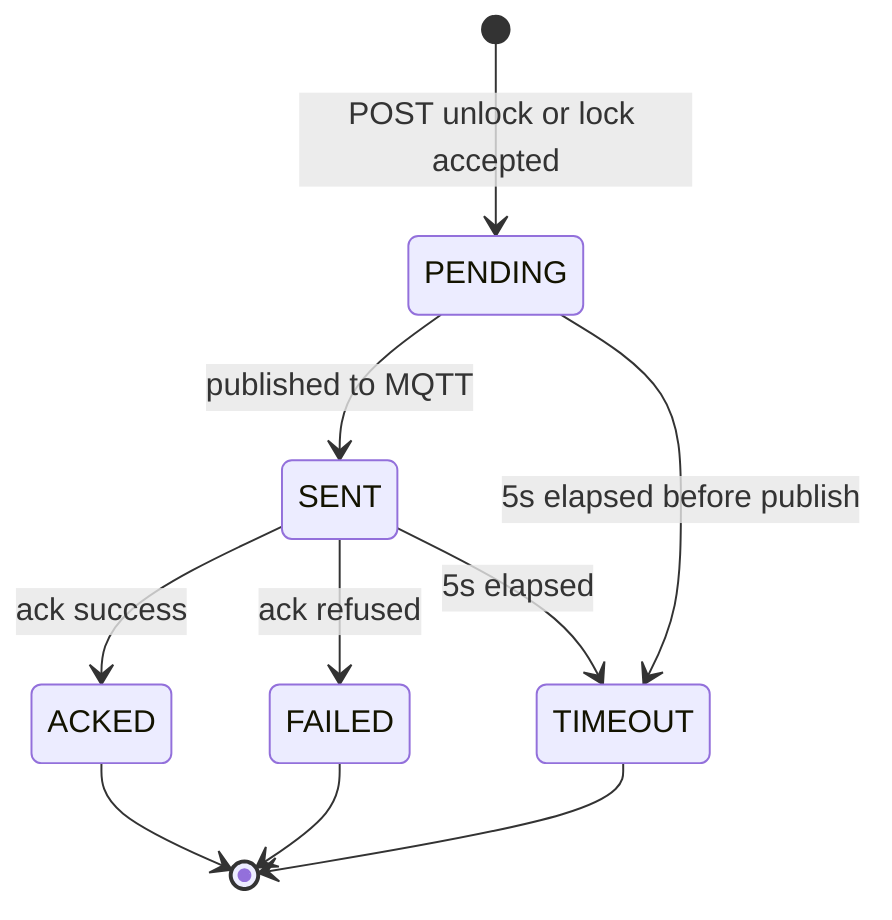

# Command state machine

Unlock and lock share this machine. The record's `action` is `unlock` or `lock`. Expiry is 5 seconds from **SENT** (publish).

## States

| State | Meaning |
|---|---|
| `PENDING` | HTTP accepted the command; not yet published to MQTT. |
| `SENT` | Published on `fleet/{vin}/commands`; waiting for ack. |
| `ACKED` | Device published a successful ack. Terminal. |
| `FAILED` | Device published a refused ack. Terminal. |
| `TIMEOUT` | No ack before 5 seconds. Terminal. |

No other command states exist. "OCIOSO" is a UI label for *no command*, not a backend state.

## Transitions

- Idempotent replay (same vin + action + `Idempotency-Key`) returns the existing record; it does not restart the machine.
- A distinct new command while one is `PENDING` or `SENT` is accepted as a second `PENDING` and stays unpublished until the in-flight command terminals, then publishes (`SENT`) and starts its own 5s clock.
- Queue depth is one. A third distinct command while the slot is full returns `409` and the in-flight command.
- A new command after a terminal state with an empty queue starts immediately.
- Offline vehicle: never acks → `TIMEOUT` (CAP-4).
- ~10% of reachable executions: refused ack → `FAILED` (CAP-5).

UI labels and colours for these states: `ux.md`.
