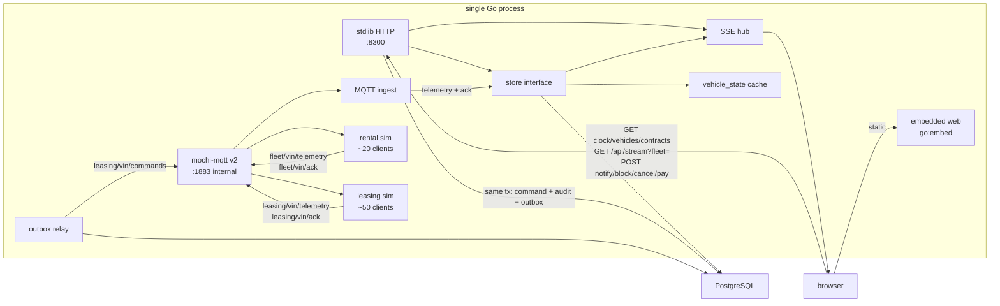
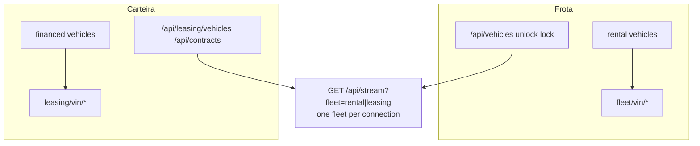

# Architecture diagrams

## Runtime



## Block-command path

```mermaid
sequenceDiagram
  actor Op as Visitor
  participant API as HTTP
  participant Store as Store
  participant PG as PostgreSQL
  participant Rel as Outbox relay
  participant Bro as MQTT broker
  participant Veh as Leasing device
  Op->>API: POST /api/contracts/{id}/block + reason + Idempotency-Key
  API->>API: policy 16d + notify 48h + online
  alt policy fail
    API-->>Op: 422 readable code
  else interval or rate
    API-->>Op: 409 or 429 Retry-After
  else accepted
    API->>PG: tx command REQUESTED + audit + outbox
    API-->>Op: 202 {commandId}
    Store-->>Op: SSE solicitado then ARMED
    Note over Store,Veh: ARMED waits for speed 0, ignition off, online
    Store->>PG: SENT when safe
    Rel->>Bro: leasing/{vin}/commands
    Bro->>Veh: block
    alt ack success
      Veh->>Bro: ack OK
      Bro->>Store: ACKED
      Store->>Store: vehicle blocked; sim will not move
    else device refuses
      Veh->>Bro: ack fail
      Bro->>Store: FAILED
    else armed and offline > 30s
      Store->>Store: TIMEOUT
    end
    Store-->>Op: SSE command + vehicle
  end
```

## Payment release

```mermaid
sequenceDiagram
  actor Op as Visitor
  participant API as HTTP
  participant Store as Store
  participant Veh as Leasing device
  Op->>API: POST /api/contracts/{id}/payments
  API->>Store: persist payment; recompute late
  alt still late
    Store-->>Op: SSE contract patch
  else late is 0 and REQUESTED or ARMED
    Store->>Store: CANCELLED; vehicle Ativo
    Store-->>Op: SSE cancel
  else late is 0 and blocked, device online
    Store->>Veh: unlock via outbox
    Veh-->>Store: ack
    Store-->>Op: SSE unlock confirmed
  else late is 0 and blocked, device offline
    Store->>Store: desbloqueio_pendente
    Veh-->>Store: reconnect
    Store->>Veh: deliver pending unlock
    Store-->>Op: SSE unlock confirmed
  end
```

## Fleet isolation


