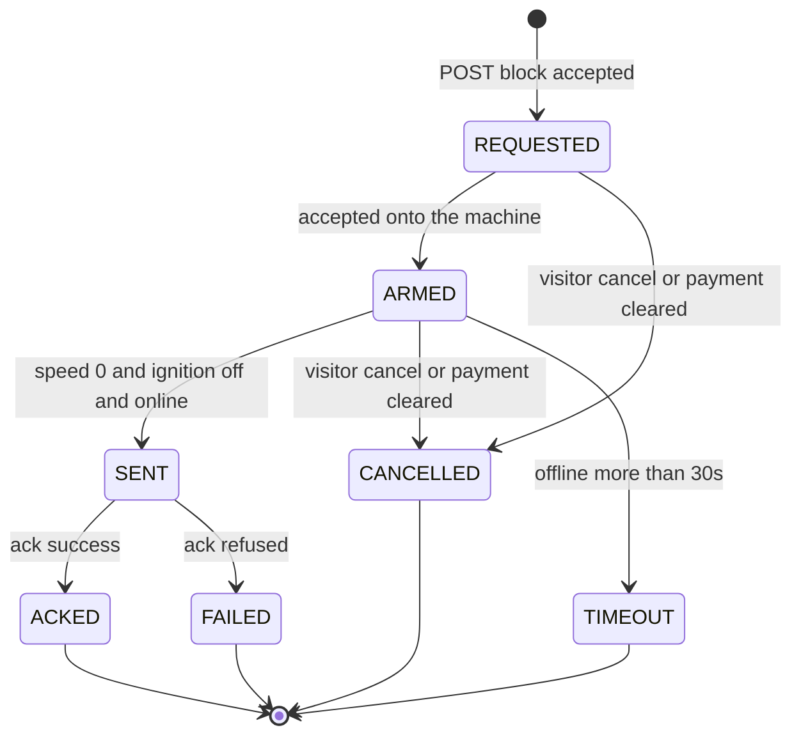

# State machines

Leasing block commands use this machine. Rental door unlock/lock stays on the phase-1 machine in `../spec-fleet-pulse/state-machines.md` (5s from `SENT`, no `ARMED`).

UI labels and colours: `ux.md`.

## Block command states

Backend identifiers are English. Labels are the design Portuguese.

| Backend | Label | Meaning |
|---|---|---|
| *(none)* | `OCIOSO` | No command. UI only. |
| `REQUESTED` | `SOLICITADO` | Dialog confirmed. Short (~0.9s in the mock). Accent, pulsing dot. |
| `ARMED` | `ARMADO · aguardando veículo parar` | Waiting on a **vehicle condition**, not on I/O. Amber, breathing dot. Lasts minutes. Cancel available. |
| `SENT` | `ENVIADO · aguardando ACK` | Published after speed 0, ignition off, device online. Accent, pulsing dot. Cancel refused (`Comando em trânsito`). |
| `ACKED` | `CONFIRMADO` | Device accepted. Vehicle becomes `Bloqueado`. Terminal. |
| `CANCELLED` | `CANCELADO` | Manual cancel, or automatic once debt is settled. Neutral — not an error. Terminal. |
| `FAILED` | `FALHOU` | Device refused. Vehicle returns to `Ativo`. Terminal. |
| `TIMEOUT` | `EXPIRADO` | `ARMED` with the device offline more than **30s**. Amber, not red: nothing was done to the car. Terminal. |

- Idempotent replay (same contract + `block` + `Idempotency-Key`) returns the existing record; it does not restart the machine.
- `ARMED` → `SENT` is forbidden while the SSE stream is degraded. The command stays `ARMED`.
- Payment that brings late to 0 cancels `REQUESTED` or `ARMED` and, if the vehicle is already `ACKED`/blocked, starts the unlock path.
- Unlock of a blocked vehicle when the device is offline becomes vehicle state `desbloqueio_pendente` and is published on reconnect.
- Retry after `FAILED` or `TIMEOUT` still pays the 20s contract interval.

## Vehicle presentation states (leasing)

Frontend labels. Backend publishes telemetry plus command/block flags, not these words.

| State | Label | When |
|---|---|---|
| `ativo` | `Ativo` | Not armed, not blocked, not unlock-pending. |
| `armado` | `Bloqueio armado` | In-flight block is `ARMED`. |
| `bloqueado` | `Bloqueado` | Last block is `ACKED` and not yet released. |
| `desbloqueio_pendente` | `Desbloq. pendente` | Unlock accepted while the device is offline. |

Device online/offline is **orthogonal**. Offline is a row/marker signal, not a fifth vehicle state. A blocked vehicle is the only non-selected marker with a filled chip.

## Overdue bands

Derived from simulated now minus next due date. Not stored as an enum the server blindly trusts from the client.

| Band | Days late | Segments | Colour token |
|---|---|---|---|
| Em dia | 0 | 0 | `--text-3` |
| 1–15 dias | 1–15 | 1 | `--late-1` |
| 16–30 dias | 16–30 | 2 | `--late-2` |
| \> 30 dias | \>30 | 3 | `--late-3` |

Block policy uses **16+**, not the brief’s 30. Notify is allowed from band 1–15 upward, subject to the 24h cooldown.

## Unlock / cancel path

| Situation | Result |
|---|---|
| `ARMED` or `REQUESTED` + cancel | `CANCELLED`, vehicle `Ativo`. |
| `SENT` + cancel | Refused: `Comando em trânsito`. |
| Blocked + cancel or payment-clear, device online | Unlock published (`enviado`); on ack, vehicle `Ativo`. |
| Blocked + cancel or payment-clear, device offline | Vehicle `desbloqueio_pendente`; publish on reconnect. |
| `desbloqueio_pendente` + cancel | Refused: `Desbloqueio já pendente`. |
